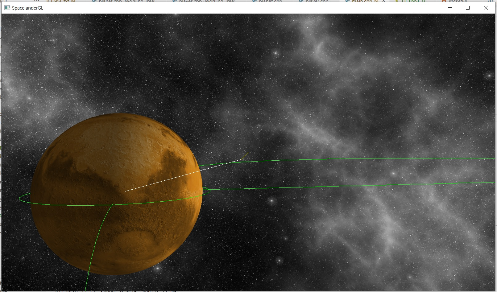

# SpacelanderGL: Space simulator with OpenGL
 
Move the spaceship to land on the planet.

## Control
- WASD: moves the camera
- Brackets (`[`, `]`): Accelerates/Decelerates the spaceship.

## HUD
- Green lines: The orbit of the planet
- Yellow line: The velocity of the spaceship.
- White line: The direction to the planet.

## Score
To achieve high score, the speed should be low and the direction of the velocity should be parallel to the direction to the planet.

## Assets used
- [Planet](https://sketchfab.com/3d-models/mars-2b46962637ee4311af8f0d1d0709fbb2) (CC-BY-4.0) [#](resources/mars/LICENSE.txt)
- Modified [Skybox](https://opengameart.org/content/space-skyboxes-0) (CC0) [#](resources/textures/skybox/LICENSE.txt)

## Libraries used
- OpenGL
- [GLAD](https://github.com/Dav1dde/glad/blob/glad2/LICENSE)
- [GLFW](https://github.com/glfw/glfw/blob/master/LICENSE.md)
- [Assimp](https://github.com/assimp/assimp/blob/master/LICENSE)
- [LearnOpenGL](https://github.com/JoeyDeVries/LearnOpenGL/blob/master/LICENSE.md) for the base code and headers

## Building
1. Rebuild the GLFW and Assimp
2. Regenerate `glad.c`, if needed
3. Set Assimp DLL at the PATH (and zlib too)
4. Change `include/root_directory.h` accordingly
5. Change `Makefile` if needed